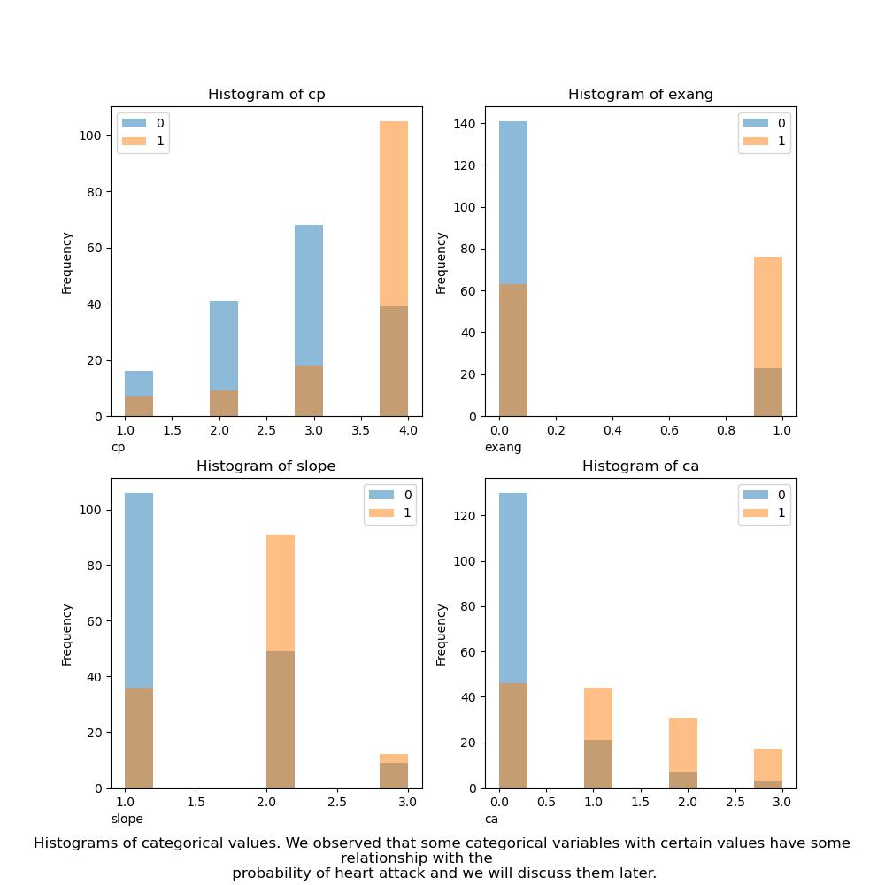

```{r setup, include=FALSE}
knitr::opts_chunk$set(echo = FALSE)
library(knitr)
library(kableExtra)
library(tidyverse)
```

```{r load model results}

```

<!-- #region tags=[] -->
# Summary

In this project we attempt to find the association between the probability of heart disease and various demographic or medical factors of the patients including including age, sex, chest pain type, cholesterol levels etc. In this study, we are performing hypothesis testing using permutation test for numerical variables such as age, the maximum heart rate achieved, and ST depression induced by exercise relative to rest which is considered a proven ECG finding for obstructive coronary atherosclerosis [@lanza2004diagnostic]. Our original data set also included some categorical variables that we use to conduct our hypothesis testing using Chi-Squared Test in the analysis of contingency tables.

We conclude that people with heart disease will have higher average age, lower maximum heart rate achieved, and higher ST depression induced by exercise relative to rest comparing to people without heart disease. We also found that sex, chest pain type, exercise induced angina, slope of the peak exercise ST segment, number of major vessels, and defect type are associated with presence of heart disease.
<!-- #endregion -->

<!-- #region tags=[] -->
# 1. Introduction

Cardiovascular diseases are the leading cause of death world wide. It is estimated by the World Health Organization that there are around 17.9 million people who die because of the cardiovascular diseases yearly. It is an estimated 32% of all deaths worldwide [@who]. Some of the important risk factors that contribute to heart disease are unhealthy diet, sedentary lifestyle, tobacco, alcohol abuse and many more. The projection is that the prevalence of heart attack in both genders, man and women, will increase compared with 2025 for ischemic heart disease by 31.1% (21.9M to 28.7M), heart failure by 33.0% (9.7M to 12.9M), myocardial infarction by 30.1% (12.3M to 16.0M), and stroke by 34.3% (10.8M to 14.5M) [@mohebi2022cardiovascular].

Here we are using inferential statistics methods to infer about the relationship between the risks of heart attack and different factors taht might be associated with heart attack. If we were to find the relationship between the different factors contributing the elevated risks of heart attack then we would be able to mitigate the risk by lowering the effect of those contributing factors on individuals lifestyles. In this study we are asked several inferential question and evaluated the statistical significance of the variables contributed to increased risks of heart attack.

# 2. Data

### 2.1 Source
The data set used in this project is the heart disease data set from the UCI machine learning repository [@aha]. The original unprocessed source data files includes 76 features about the patents from 4 regions (Cleveland, Hungary, Switzerland, and the VA Long Beach). The unprocessed data contains lots of unidentified values, missing values and uncleaned data for many features. Among the data files from the 4 regions, only the data from Cleveland has been cleaned and became widely used by the data science community. The source data set was created by Robert Detrano at V.A. Medical Center, Long Beach and Cleveland Clinic Foundation. The cleaned Cleveland data is sourced from the UCI machine learning repository (Dua and Graff 2017) and can be found [here](https://archive.ics.uci.edu/ml/datasets/Heart+Disease). This data set contains 14 features that deemed to be relevant by the ML researchers. In this project, we will use the cleaned and processed Cleveland data set to conduct an inferential study on factors that could be associated with presence of heart disease.

### 2.2 Explanatory data analysis
<!-- #endregion -->
After some basic data cleaning, we can find our data contain both numeric and categorical features, but they are stored in numeric values.   
At the very beginning, it is beneficial for us to look at the correlation table of each numeric factor to the target and then choose our numeric factors with relatively high absolute value of correlation.   
Then, we can use graphical method to analyze the numeric factors to find whether it is related to the probability of heart attack. From all the plots, we can find the factors we want to research on.  
\n

```{r fig.align='center'}
knitr::include_graphics("../results/numeric.jpg")
```
\n  

Finally, for the categorical variables, we look at the count of each category among the two groups and select four significant categorical variables below.  

```{r fig.align='center'}

```


# 3. Data Analysis & Results

```{r load result csv, include=FALSE}
library(here)

ci <- read.csv(here("results", "bootstrap_ci_results.csv"))
ci$target <- ifelse(ci$target ==0, "No heart disease", "Presence of heart disease")
num_res <- read.csv(here("results", "hypothesis_result.csv"))
cat_res <- read.csv(here("results", "chisq_result.csv"))

```

### 3.1. Investigation on numeric variables
Based on the exploratory data analysis, we identified the following numeric variables that could potentially associate with presence of heart disease. 

- Higher age

- Lower maximum heart rate achieved

- Higher ST depression induced by exercise relative to rest. 'ST' relates to positions on the ECG plot that often indicates certain emergent condition.

**Methods of Analysis**

As the first step, we compare the sample estimates of these variables of interest between people with heart disease and people without heart disease, and use bootstrapping to estimate a 95% confidence interval as the precision measure of our sample estimates. These statistics give us an overview of how the variables of interest differ between the two groups. 

Secondly, hypothesis testings with permutation are conducted for each of the selected variables to see if there were enough statistical evidence to reject the null hypothesis and state that the variable is indeed associated with presence of heart disease. For age and maximum heart rate achieved, we compare the sample means, and for ST depression induced by exercise, we compare the sample medians due to the skewed distribution of the variable values. We will focus on presenting the conclusion in the discussion below, and more detailed results for permutation hypothesis testing (test statistics, all p-values) are shown in the summary table 3.4.


Let's look at the result of the investigated variable in more detail.

#### Age

**The average age of people with presence of heart disease is greater than the average age of people without heart disease.**

The table below shows the sample means of age for people with heart disease and people without heart disease. The average age of people with heart disease is `r ci$sample_estimates[2]`, which is greater than the average age of people without heart disease `r ci$sample_estimates[1]`. The 95% bootstrap CI are not overlapping, further indicates the possibility that the average age of people with presence of heart disease is greater than the average age of people without heart disease.

```{r table, echo=FALSE}
knitr::kable(ci[1:2, 2:5], caption = "Table 3.1 Sample estimates and 95% bootstrap CI for average age of people with and without heart disease") |>
	kableExtra::kable_styling(full_width = FALSE)
```

Hypothesis testing with permutation was then conducted for average age at a significance level of 0.05, with null hypothesis that the average age of people with presence of heart disease is equal to the average age of people without heart disease. The alternative hypothesis is that the average age of people with presence of heart disease is greater than the average age of people without heart disease. We found that there are enough statistical evidence to reject the null and state that the average age of people with presence of heart disease is greater than the average age of people without heart disease (p-value = `r num_res$p_values[[1]]`, less than 0.05). 


#### Maximum heart rate achieved

**The average maximum heart rate achieved of people with presence of heart disease is lower than the average maximum heart rate achieved of people without heart disease.**

The table below shows the sample means of maximum heart rate achieved for people with heart disease and people without heart disease. The average maximum heart rate achieved of people with heart disease is `r ci$sample_estimates[4]`, which is lower than that of people without heart disease `r ci$sample_estimates[3]`. The 95% bootstrap CI are not overlapping, further indicates the possibility that the average maximum heart rate achieved of people with presence of heart disease is lower than the average age of people without heart disease.

```{r maximum heart rate achieved, echo=FALSE}
knitr::kable(ci[3:4, 2:5], caption = "Table 3.2 Sample estimates and 95% bootstrap CI for average maximum heart rate achieved of people with and without heart disease") |>
	kableExtra::kable_styling(full_width = FALSE)
```

Hypothesis testing with permutation was then conducted for average maximum heart rate achieved at a significance level of 0.05, with null hypothesis that the average maximum heart rate achieved of people with presence of heart disease is equal to that of people without heart disease. The alternative hypothesis is that the average maximum heart rate achieved of people with presence of heart disease is lower than that of people without heart disease. We found that there are enough statistical evidence to reject the null and state that the average maximum heart rate achieved of people with presence of heart disease is lower than the average age of people without heart disease (p-value = `r num_res$p_values[[2]]`, less than 0.05). 


#### ST depression induced by exercise relative to rest

**The median ST depression induced by exercise relative to rest of people with presence of heart disease is greater than that of people without heart disease.**

The table below shows the sample median ST depression induced by exercise for people with heart disease and people without heart disease. The median ST depression induced by exercise of people with heart disease is `r ci$sample_estimates[6]`, which is greater than that of people without heart disease `r ci$sample_estimates[5]`. The 95% bootstrap CI are not overlapping, further indicates the possibility that the median ST depression induced by exercise of people with presence of heart disease is greater than that of people without heart disease.

```{r st depression, echo=FALSE}
knitr::kable(ci[5:6, 2:5], caption = "Table 3.3 Sample estimates and 95% bootstrap CI for median ST depression induced by exercise of people with and without heart disease") |>
	kableExtra::kable_styling(full_width = FALSE)
```

Hypothesis testing with permutation was then conducted for average maximum heart rate achieved at a significance level of 0.05, with null hypothesis that the average maximum heart rate achieved of people with presence of heart disease is equal to that of people without heart disease. The alternative hypothesis is that the average maximum heart rate achieved of people with presence of heart disease is lower than that of people without heart disease. We found that there are enough statistical evidence to reject the null and state that the average maximum heart rate achieved of people with presence of heart disease is lower than the average age of people without heart disease (p-value = `r num_res$p_values[[3]]`, less than 0.05). 


Note: Table 3.4 summarized the information on the permutation hypothesis testing for the numeric variables.
```{r all hypothesis result, echo=FALSE}
knitr::kable(num_res, caption = "Table 3.4 Permutation hypothesis tests results for numeric variables of interest") |>
	kableExtra::kable_styling(full_width = FALSE)
```


### 3.2. Investigation on categorical variables

**Methods of Analysis**

For categorical variables, it is challenging to identify a clear association purely based on visual examination, thus we conducted chi-square tests for the 8 categorical variables in the data set. The null hypothesis of Chi-square test is that the variable of interest and presence of heart disease are independent with each other. The alternative hypothesis of Chi-square test is that the variable of interest is related with presence of heart disease. Since multiple tests were conducted, the tests suffer from inflated type I error. Thus the significance level is adjusted using the Bonferroni correction.

**Results**

Table 3.5 summarizes the chi-square tests results for the 8 categorical variables.
```{r chi sq result, echo=FALSE}
knitr::kable(cat_res, caption = "Table 3.5 Chi-square tests results for categorical variables of interest") |>
	kableExtra::kable_styling(full_width = FALSE)
```

Based on these test results, we found that there were enough statistical evidence (p-value < 0.00625) to reject the null hypothesis in favor of the alternative hypothesis, and state that sex, chest pain type, exercise induced angina, slope of the peak exercise ST segment, number of major vessels, and defect type are related with presence of heart disease.


# 4. Limitations & Future Improvements

This study has several strength and limitations. The most important strength is that it is one of the few studies that looked at the different factors associated with heart disease by employing inferential statistics methods using UCI data set. Most of of the studies done previously were focused on predictions using the machine learning models. The limitations of this study is that since the data analyzed is from a population that hasn't been fully quantified, we can't be fully sure about the statistics being calculated. Our data set is only limited to few examples from Cleveland data set. Due to this limited sample data drawn from the census, there always be some level of uncertainly in this study. The second limitation is that in order for us to conduct hypothesis testing, we are required to make certain assumptions and educated guesses on what variables are most likely to have an association. This will bring some level of uncertainty to the results gathered from this study. In addition, conducting many hypothesis testing may elevate the level of bias or multiple comparison problem where we consider multiple statistical inferences simultaneously. To mitigate the severity of this problem, we defined a more strict significance level for all of the individual hypothesis testings. We used Bonferroni correction to reduce the probability of commiting type I error, though this method is known to be on the conservative side. Furthermore, we could apply intrinsic originality to categorical variables in Chi-Squared test, however, due to limited domain knowledge, we were unable to do so in this study. Even there are some limitation in our study, at least it will allow further studies to build upon the conclusions drawn here and consider the effects of other variables associated with increase heart disease risks. Finally, to further improve this study, the analysis could focus on building models to estimate the how the likelihood of presence of heart disease is impacted by changing certain variables values while holding other factors constant. For this, we would require mode knowledge on liner regression to evaluate statistical significance of multiple linear regression model.

# References
